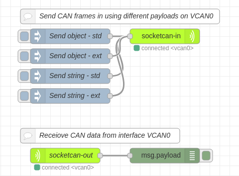

# node-red-contrib-socketcan



This is a couple of nodes to read CAN frames from and send CAN frames to a CAN bus using socketcan. [Socketcan](https://www.kernel.org/doc/Documentation/networking/can.txt) is the standard CAN subsystem on Linux. Socketcan is not available on Windows.

This project is inspired by [node-red-contrib-canbus](https://flows.nodered.org/node/node-red-contrib-canbus) (Rajesh Sola <rajeshsola@gmail.com>) which almost did what I needed but not quite.

[can-utils](https://github.com/linux-can/can-utils) is a good set of companion tools when working with socketcan.

Some info about bringing a (virtual) CAN interface up is [here](https://elinux.org/Bringing_CAN_interface_up). If you need real CAN hardware [TouCAN](https://www.rusoku.com/products) is a good choice (no affiliation except for using it myself).

This project is part of the VSCP ([https://www.vscp.org](https://www.vscp.org)) project.

## Install

Go to node-red folder and

```bash
npm install node-red-contrib-socketcan
```

or install in node-red palette.

## Sending CAN frames


<b>socketcan-in</b> node is provided for sending CAN frames. You can send standard or extended id frames, FD frames are supported. 

Set up the interface to some real CAN hardware or use a virtual interface.

### payload

#### Object/JSON formated message
The CAN message is defined as a JSON object with the following payload format

```json
{
	"canfd":false,
	"ext":false,
	"rtr":false,
	"canid":123,
	"dlc":5,
	"data":[1,2,3,4,5]}
}
```
* <b>canfd</b> - Marks the frame as a CAN-FD frame.
* <b>ext</b> - Marks the message as an extended id message.
* <b>rtr</b> - The message is a remote transmission request. No data should be specified in this case (set to null).
* <b>canid</b> - The canid for the CAN message. Must be less then 0x7ff for a standard CAN message.
* <b>dlc</b> - Number of databytes, 0-64.
* <b>data</b> - An array, comma separated list or buffer with data bytes. Set to null if no data.

#### String formated messages

The CAN message is defined as a string with the following payload format

```
<canid>#{R|data}
```

* <b>canid</b> - Less than 0x7ff and with less than three digits for a standard id. Always defined in hex format.
* <b>data</b> - The data part for the can frame. Always in hex format.
* <b>R</b> - Specifies a remote transmission request frame.

##### Examples

```
123#DEADBEEF - standard frame 
5AA#         - Standard frame no data
1F334455#1122334455667788 - extended frame
123#R         - for remote transmission request.
123##         - FD frame no data
123##AA       - FD frame standard
```

## Receiving CAN frames


<b>socketcan-out</b> node is provided for receiving CAN frames. You can receive standard or extended CAN id frames. 

Set up the interface to some real CAN hardware or use a virtual interface.

### Payload

The payload is always a Javascript object on the following form.

{
	timestamp: 1552881174,
	ext: 0,
	rtr: 0,
	canid: 123,
	dlc: 5,
	data: [1,2,3,4,5]
}

* <b>canid</b> - The standard or extended can id.
* <b>ext</b> - Set to true if this is a extended id frame. False otherwise.
* <b>rtr</b> - Specifies a remote transmission request frame if set to true.
* <b>dlc</b> - Number of databytes.
* <b>data</b> - An array with data or null or an empty array if no data. 

The timestamp (in microseconds) is generated by the node if not supplied by the interface.

## Example flow

Enable a virtual CAN interface with

```bash
$ modprobe vcan
$ sudo ip link add dev vcan0 type vcan
$ sudo ip link set up vcan0
```

install can-utils with

```bash
sudo apt install can-utils
```

Receive CAN frames with

```bash
candump vcan0
```

Send CAN frames with

```bash
cansend vcan0 123#1122334455
```

Use this flow to interact with the other tools.

```json
[
    {
        "id": "829af3ee.a57c1",
        "type": "tab",
        "label": "Flow 1",
        "disabled": false,
        "info": ""
    },
    {
        "id": "b2855d5b.1215c8",
        "type": "socketcan-config",
        "z": "",
        "interface": "can0"
    },
    {
        "id": "38e8307.1653f5",
        "type": "socketcan-config",
        "z": "",
        "interface": "vcan0"
    },
    {
        "id": "7b24a62e.8f5458",
        "type": "debug",
        "z": "829af3ee.a57c1",
        "name": "",
        "active": true,
        "tosidebar": true,
        "console": false,
        "tostatus": false,
        "complete": "false",
        "x": 350,
        "y": 360,
        "wires": []
    },
    {
        "id": "5f671b29.cd24bc",
        "type": "socketcan-out",
        "z": "829af3ee.a57c1",
        "name": "socketcan-out",
        "config": "38e8307.1653f5",
        "x": 150,
        "y": 360,
        "wires": [
            [
                "7b24a62e.8f5458"
            ]
        ]
    },
    {
        "id": "caba412f.047b2",
        "type": "socketcan-in",
        "z": "829af3ee.a57c1",
        "name": "socketcan-out",
        "config": "38e8307.1653f5",
        "x": 360,
        "y": 120,
        "wires": []
    },
    {
        "id": "a64240cb.3f0788",
        "type": "inject",
        "z": "829af3ee.a57c1",
        "name": "Send object - std",
        "topic": "",
        "payload": "{\"ext\":false,\"canid\":123,\"dlc\":5,\"data\":[1,2,3,4,5]}",
        "payloadType": "json",
        "repeat": "",
        "crontab": "",
        "once": false,
        "onceDelay": 0.1,
        "x": 160,
        "y": 120,
        "wires": [
            [
                "caba412f.047b2"
            ]
        ]
    },
    {
        "id": "3ff96369.ef6f5c",
        "type": "inject",
        "z": "829af3ee.a57c1",
        "name": "Send string - std",
        "topic": "",
        "payload": "123#00112233",
        "payloadType": "str",
        "repeat": "",
        "crontab": "",
        "once": false,
        "onceDelay": 0.1,
        "x": 160,
        "y": 200,
        "wires": [
            [
                "caba412f.047b2"
            ]
        ]
    },
    {
        "id": "6879c00a.5edb68",
        "type": "inject",
        "z": "829af3ee.a57c1",
        "name": "Send string - ext",
        "topic": "",
        "payload": "1F334455#1122334455667788",
        "payloadType": "str",
        "repeat": "",
        "crontab": "",
        "once": false,
        "onceDelay": 0.1,
        "x": 160,
        "y": 240,
        "wires": [
            [
                "caba412f.047b2"
            ]
        ]
    },
    {
        "id": "1ee3b274.4cb8fe",
        "type": "inject",
        "z": "829af3ee.a57c1",
        "name": "Send object - ext",
        "topic": "",
        "payload": "{\"ext\":true,\"canid\":32278,\"dlc\":5,\"data\":[1,2,3,4,5]}",
        "payloadType": "json",
        "repeat": "",
        "crontab": "",
        "once": false,
        "onceDelay": 0.1,
        "x": 160,
        "y": 160,
        "wires": [
            [
                "caba412f.047b2"
            ]
        ]
    },
    {
        "id": "391a4c45.7acd8c",
        "type": "comment",
        "z": "829af3ee.a57c1",
        "name": "Send CAN frames in using different payloads on VCAN0",
        "info": "",
        "x": 260,
        "y": 80,
        "wires": []
    },
    {
        "id": "912f9928.da2758",
        "type": "comment",
        "z": "829af3ee.a57c1",
        "name": "Receiove CAN data from interface VCAN0",
        "info": "",
        "x": 220,
        "y": 320,
        "wires": []
    }
]
```

## Debugging

It is possible to get extra debug information from the nodes in this package.

Issue

``` bash
export NODE_DEBUG=socketcan-in
```
before starting node-red to get extra debug info for the socketcan-in node.

Issue

``` bash
export NODE_DEBUG=socketcan-out
```
before starting node-red to get extra debug info for the socketcan-out node.

Issue

``` bash
export NODE_DEBUG=socketcan-in socketcan-out
```
before starting node-red to get extra debug info for both the socketcan-in and socketcan-out node.
